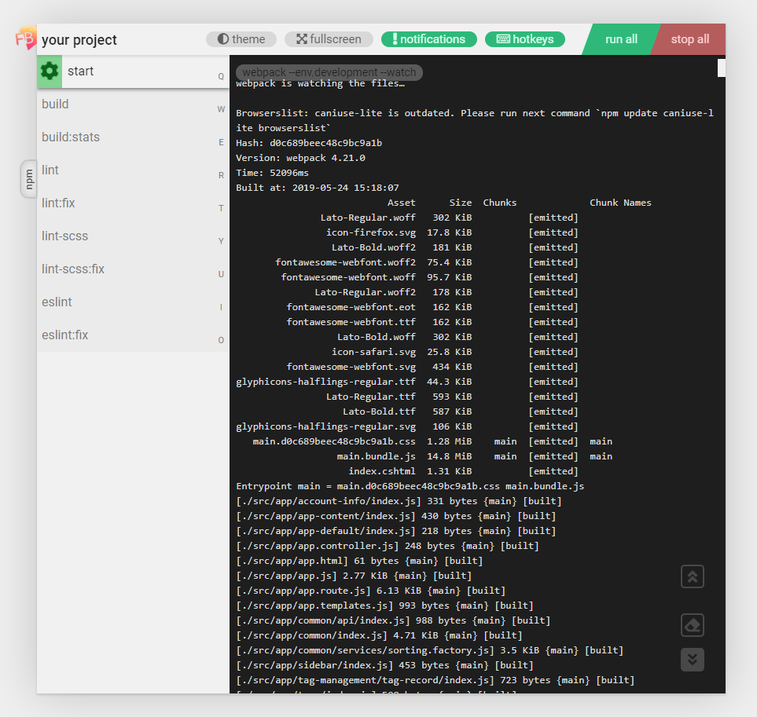

  
   
   

   

<h1>🔥 flamebird 🔥</h1>
  

    the nodejs task manager for Procfile-based or npm-based applications
  

## 🚀 Installation

    $ npm install -g flamebird

## 📄 Usage

To start Flamebird you can use `fb [command] [options]` (or longer alias `flamebird [command] [options]`). 
Application provides two commands: `fb start` and `fb web` (read below).

Need help? Use command:

    $ fb --help
    # or simply
    $ fb

## 💻 Console version (`fb start`)

    $ fb start [options]

Run tasks from `Procfile` or `package.json` 

Options:
- `-p, --package` - using package.json for the managing tasks. (:warning: with this option the command `start` run all tasks from `package.json`, for resolving it , please use option `-t`)
- `-t, --tasks [tasks]` - list of tasks which needs to async run in `fb start` ( example : `fb start --tasks start,start:dev,start-server` and then tasks are `start`,`start:dev`,`start-server` will have been runned asynchronously )

## 💻 Web version (`fb web`)

    $ fb web [options]

Launch web-application which is task-manager. That command has more abilities than `start`. Web-application is reading `Procfile` and `package.json` and adding ability to launch scripts inside this files together

Options:
- `-t, --tasks [tasks]` - list of tasks which will be managing in the `fb web` command ( example : `fb web --tasks start,start:dev,start-server` and this tasks will be showing in the web-application `start`,`start:dev`,`start-server` )
- `-p, --port <PORT>` - sets the server port, by default `5050`
- `-n, --name <NAME>` - sets the project name. Display name of the project in title and header. By default using name of project inside `package.json` otherwise `flamebird`

<h3>hotkeys</h3>

hotkeys works only if  is triggered.

hotkey | action
------------ | -------------
<kbd>Q</kbd>,<kbd>W</kbd>,<kbd>E</kbd>...<kbd>M</kbd>,<kbd>&lt;</kbd>,<kbd>&gt;</kbd>,<kbd>/</kbd> | Open task which assigned to specific key. 
<kbd>SHIFT</kbd> + <kbd>R</kbd> | Run/Stop selected task.
<kbd>TAB</kbd> | Switch between `Procfile` and `package.json` tabs
<kbd>DEL</kbd> | Clear logs in selected task
<kbd>&uparrow;</kbd> | Partially scroll up logs in selected task
<kbd>&downarrow;</kbd> | Partially scroll down logs in selected task
<kbd>SHIFT</kbd> + <kbd>&uparrow;</kbd> | Fully scroll up logs in selected task
<kbd>SHIFT</kbd> + <kbd>&downarrow;</kbd> | Fully scroll down logs in selected task
<kbd>SHIFT</kbd> + <kbd>A</kbd> | Run all tasks
<kbd>SHIFT</kbd> + <kbd>S</kbd> | Stop all tasks

<h3>How it looks:</h3>

## Contribution  

If you want to help this project you need to read this part of readme.md for more detail understanding of for what some things are needed.  

First of all take a look at project structure:  

- [flamebird.js](./flamebird.js)
- [LICENSE](./LICENSE)
- [list.md](./list.md)
- [nodemon.json](./nodemon.json)
- [node_modules](./node_modules) - you know what is that :D
- [package-lock.json](./package-lock.json)
- [package.json](./package.json)
- [postinstall.js](./postinstall.js)
- [Procfile](./Procfile)
- [README.md](./README.md)
- [webpack.config.js](./webpack.config.js)
- [babel.config.js](./babel.config.js)
- [CHANGELOG.md](./CHANGELOG.md)
- __assets__
  - [task_button.png](./assets/task_button.png)
  - [hotkeys_button.png](./assets/hotkeys_button.png)
  - [web-ui-screen.png](./assets/web-ui-screen.png)
- __client__
  - __controllers__
    - [Header.js](./client/controllers/Header.js)
  - __assets__
    - [logo.psd](./client/assets/logo.psd)
    - [logo.png](./client/assets/logo.png)
    - [logo2_small.png](./client/assets/logo2_small.png)
    - [logo2.png](./client/assets/logo2.png)
    - [logo2_transparent.png](./client/assets/logo2_transparent.png)
  - __helpers__
    - [dom_utils.js](./client/helpers/dom_utils.js)
    - [hotKeys.js](./client/helpers/hotKeys.js)
    - [tabs.js](./client/helpers/tabs.js)
    - [taskList.js](./client/helpers/taskList.js)
    - [WindowAttached.js](./client/helpers/WindowAttached.js)
  - [global.js](./client/global.js)
  - [index.html](./client/index.html)
  - [medium-screens.css](./client/medium-screens.css)
  - __scripts__
    - [Api.js](./client/scripts/Api.js)
    - [Configs.js](./client/scripts/Configs.js)
    - [HotKeys.js](./client/scripts/HotKeys.js)
    - [Tabs.js](./client/scripts/Tabs.js)
    - [TaskList.js](./client/scripts/TaskList.js)
    - [ThemeSwitcher.js](./client/scripts/ThemeSwitcher.js)
    - [WebLogger.js](./client/scripts/WebLogger.js)
    - [WebSocket.js](./client/scripts/WebSocket.js)
  - [small-screens.css](./client/small-screens.css)
  - __styles__
    - [dark-theme.css](./client/styles/dark-theme.css)
    - [fullscreen.css](./client/styles/fullscreen.css)
    - [hot_keys-shortcuts.css](./client/styles/hot_keys-shortcuts.css)
  - [styles.css](./client/styles.css)
- __dist__ - frontend build folder
- __server__
  - [config.js](./server/config.js) - module which working with configuration file (`.flamebirdrc`)  
  - [constants.js](./server/constants.js) - module which contains constant values. It usings on both sides (client, server)
  - [processWorker.js](./server/processWorker.js)
  - [server.js](./server/server.js)
  - __utils__
    - [colors.js](./server/utils/colors.js)
    - [commands.js](./server/utils/commands.js)
    - [emitter.js](./server/utils/emitter.js)
    - [envs.js](./server/utils/envs.js)
    - [mem_cache.js](./server/utils/mem_cache.js)
    - [processes.js](./server/utils/processes.js)
  - [ws.js](./server/ws.js)
  - [taskfile.js](./server/taskfile.js)

## 📝 License

Licensed under the [MIT License](./LICENSE).

